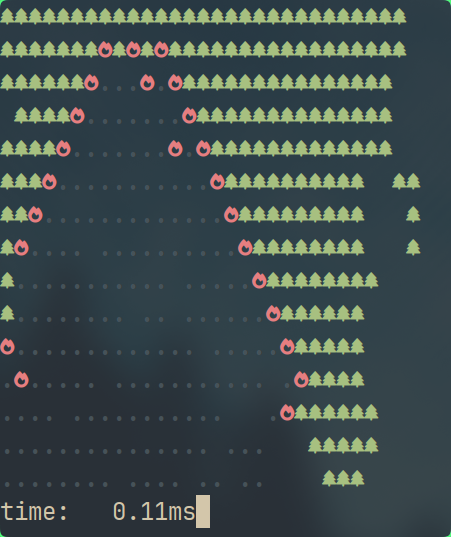

# lua-pineburn 🌲🔥

**A terminal forest wildfire simulator/screensaver in under 200 lines of Lua.**


## what it looks like? (monochrome preview, 32x16)

- ASCII characters:
    ```
       AAAAAAAAAAAAAAAA       AAA   
    A AAAAAAAAAAAAAAAAAAA AAAAAAA   
    AAAAAAAA&AAAAAAAAAAAAAAAAAAA    
     AAAAAA&.&A&AAAAAAAAAAAAAAAA    
    AAAAAA&...&.AAAAAAAAAAAAAAAA    
    AAAAA&.......&AAAAAAAAAAAA  AA  
    AAAA&.........&AAAAAAAAAAA   A  
    AAA&.. ........&AAAAAAAAAA   A  
    AA&......... ...&AAAAAAAAAA     
    A&...............&AAAAAAAA      
    AA&...............&AAAAAAA      
    AA..... ...........&AAAAAA      
    &............... ...AAAAAAA     
    ...................   AAAAA     
    ............. .. .&    AAA      
    time:   0.23ms
    ```

> `A` - pine, `&` - flame, `.` - ash

- Alacritty + Everforest Theme + FontAwesome:
    


## requirements 

- Lua 5.1+ or LuaJIT (recommended for faster simulation)

- `luaposix` library for your version of Lua (was the most convinient way to do a keyboard-interruptable sleep)

- a terminal with ANSI color support (any decent terminal)

- a burning desire to watch virtual pines turn into virtual ash

> [!note]
> With right dependencies installed this is expected to work on non-UNIX OSes as well, but no testing has been made. 


## how to run?

```bash
# you can use other version, but `luajit` is probably the fastest
luajit main.lua $COLUMNS $LINES # to occupy the entire terminal
```

> [!note]
> That the default configuration (chances) are more suitable for bigger full-screen simulations and can seem unstable on smaller sizes (too much trees / too little fire / too long for the first tree to appear).

Can be interrupted with `Ctrl-C`.


## what can I do with this?

**Whatever you want.** No, really - it's the [BSD Zero Clause (BSD0)](LICENSE) license, which means no strings nor attribution nor lawyers.

So tweak the simulation, break it, fix it, turn it into a dating sim for ANSI trees, just don't blame me if your terminal catches actual fire. *(No guarantees that it won't)*


## why?

Several years ago I played a cool game 'SUPERHOT', which has a burning forest simulation as a little easter egg in the main menu, and it really stuck with me.

Today I had actual work to do, but ended with this `\_("v")_/`


---

This is pine. 🌲
This is fine. 🔥
